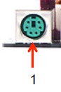
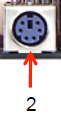
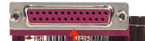
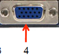
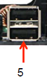
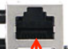
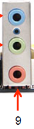

# CONECTORES EXTERNOS DE UNA PLACA BASE

## 1. Vamos a explicar y a enseñar todos los conectores de una placa base

### Conector PS/2 Para ratón
Conector mini-DIN de 6 patillas que se utiliza para conectar ratones a un sistema informático compatible con PC.

### Conector PS/2 Para teclado
Conector mini-DIN de 6 patillas que se utiliza para conectar teclados a un sistema informático compatible con PC.
  

### Puerto paralelo
Sirve para conectar dispositivos periféricos a una computadora, como impresoras, escáneres y discos duros, transmitiendo datos de forma simultánea en varios bits a la vez.

 ### Puerto VGA
Sirve para transmitir señales de video analógicas desde una computadora a un monitor, proyector o televisor.

### Puertos USB
Sirven para conectar y comunicar dispositivos electrónicos, permitiendo la transferencia de datos (como archivos, fotos o música) y la alimentación eléctrica para cargar o dar energía a otros aparatos, como teléfonos, discos duros externos o impresoras.

### Puerto RJ-45
Es un estándar de la industria de las telecomunicaciones y la informática para terminaciones de cables de red, que se utiliza para conectar dispositivos como computadoras, routers y consolas de juegos a una red local (LAN).

### Jack de entrada de audio (puerto azul)
### Jack de salida de audio (puerto verde)
### Jack de micrófono (puerto rosa)

