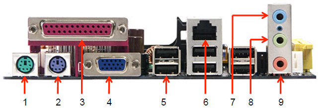

# CONECTORES EXTERNOS DE UNA PLACA BASE

## 1. Vamos a explicar y a enseñar todos los conectores de una placa base

* Conector PS/2 Para ratón: conector mini-DIN de 6 patillas que se utiliza para conectar ratones a un sistema informático compatible con PC.
  
